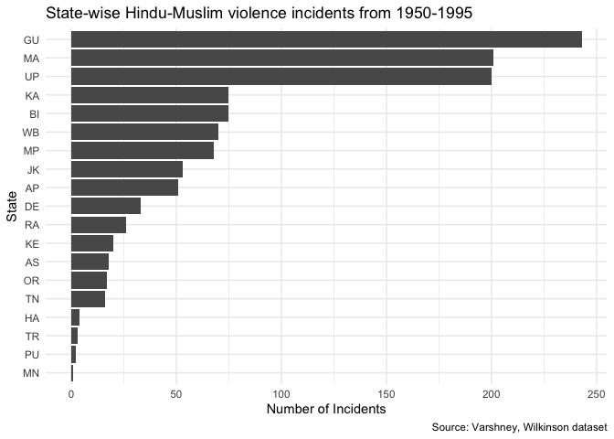
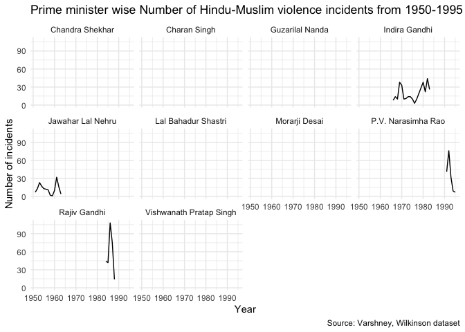
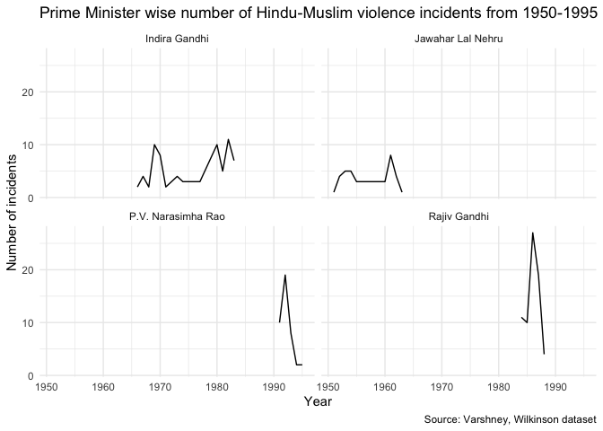

Exploring Hindu Muslim Violence in India
================
Ojaswi Malik

## Introduction

### Goal:

This report aims to explore the history of violent events between the 2
controversial religions of Hinduism and Islam in the context of
post-independant India. Keeping in mind the recent riots in the capital
New Delhi, it is essential to trace back and analyse this relationship
in the latter half of the 20th century. This report relies on the
dataset created by Varshney and Wilkinson, who collected all incidents
on Hindu-Muslim Violence in India between 1950-1995 reported in the
national newspaper Times of India.

### Importing the data files

``` r
#Importing the first dataset
hindu_muslim_data <- here("data", "hindu_muslim_violence.csv") %>%
  read_csv()

#Importing the second dataset and parsing column types
yearly_pop_pm_data <- here("data", "yearly_pop_pm.csv") %>%
  read_csv( col_types = 
              cols(
                hindu_prop = col_double(),
                muslim_prop = col_double()
              ))
```

### Data Wrangling

``` r
#Joining the 2 datasets using left join
hindu_muslim_complete_data <- left_join(
                                x = hindu_muslim_data, 
                                y = yearly_pop_pm_data
                                      )
```

## Exploring Data

### **Analysis 1**:

First, I want to see how many hindu-muslim violence incidents were
reported each year from 1950-1995

``` r
hindu_muslim_complete_data %>%
  #grouping by year to count incidents per year
  group_by(YEAR) %>%
  summarise( 
    count = n()
    ) %>%
  #plotting the line chart
  ggplot(mapping = aes(x = YEAR, y = count)) +
  geom_line() +
  #labelling the graph
  labs(
    title = "Number of Hindu-Muslim violence incidents from 1950-1995" ,
    x = "Year",
    y = "Number of incidents",
    caption = "Source: Varshney, Wilkinson dataset"
  ) 
```

<!-- -->

### **Observation 1**:

From the above graph, we can pbserve that yearly violent events are
un-related and can be extremely high in one year, and low in the next.
However, there was a peak in violent events in 1985 and 1990, which can
be explained by the communal riots in that period. Moreover, in noticing
a general trend, there has been a rise in violent events over the years.

### **Analysis 2**:

Next I want to observe the changes in Hindus and Muslims proportion of
population in the time period 1950-1995.

``` r
#Saving this graph to reuse in next analysis
prop_change <- hindu_muslim_complete_data %>%
  #grouping by year
  group_by(YEAR) %>%
  #plotting the graph
  ggplot(mapping = aes(x = YEAR)) + 
  geom_line(mapping = aes(y = hindu_prop, color = "Proportion of Hindu population")) +
  geom_line(mapping = aes(y = muslim_prop, color = "Proportion of Muslim population")) +
  #making y-axis in %
  scale_y_continuous(labels = scales::percent) +
  #labelling graph
  labs(
    title = "Proportion of Hindu and Muslim population in India  from 1950-1995" ,
    x = "Year",
    y = "Percentage",
    caption = "Source: Socio-Economic and Caste Census, 2011",
    color = NULL
  ) +
  #moving the legend to the bottom
  theme(legend.position = "bottom")
  
prop_change
```

<!-- -->

### **Observation 2**:

Although the changes have been small, we can observe a gradual decrease
in proportion of Hindus and an increase in the proportion of Muslims as
recorded in the census data between 1950-1995.

### **Analysis 3**:

Now, I want to see the number of violent events aggregated by month.
This is to observe if any month would have an unusual trend due to
seasonal or festivities causes.

``` r
hindu_muslim_complete_data %>%
  ggplot( mapping = aes(x = MONTH_BY_N)) +
  geom_bar() +
  #labelling and setiing limits to months on x-axis
  scale_x_discrete(limits = month.abb ) +
  #labelling graph
   labs(
    title = "Monthly number of Hindu-Muslim violence incidents from 1950-1995" ,
    x = "Month",
    y = "Number of incidents",
    caption = "Source: Varshney, Wilkinson dataset"
  )
```

<!-- -->

### **Observation 3**:

March has the highest number of violence incidents in the entire year.
However, it is closely followed by October and September.

### **Analysis 4**:

In this analysis, I want to observe the state-wise number of
Hindu-Muslim incidents of violents

``` r
hindu_muslim_complete_data %>%
  #filtering out NA values
  filter( !is.na(STATECODE)) %>%
  group_by(STATECODE) %>%
  summarise(
    count = n()
  ) %>%
  ggplot(mapping = aes(y = count, x = fct_reorder(STATECODE, count))) +
  geom_col() + 
  #flipping coordinates to see each state clearly
  coord_flip() +
  #labelling graph
  labs(
    title = "State-wise Hindu-Muslim violence incidents from 1950-1995" ,
    y = "Number of Incidents",
    x = "State",
    caption = "Source: Varshney, Wilkinson dataset"
  )
```

<!-- -->

### **Observation 4**:

The state of GU ie Gujarat has the highest number of incidents of
Hindu-Muslim violence. MA (Maharashtra) and UP (Uttar Pradesh) also have
extremely high number of incidents

\#\#\#**Note regarding Analysis 4**: In constructing this analysis, I
noticed the fallacies in coding the data by the authors. Initially, I
had tried to use STATE to get full state-names, but some states were
written with different spellings or had another tiny differences which
lead to similiar states being printed multiple times. However, the use
of STATECODE resolved this error.

### **Analysis 5**:

In this analysis, I want to focus on the top 3 states observed above
i.e. Gujarat, Maharashtra and Uttar Pradesh. Specifically I want to see
the distribution of the number of people killed in an incident for the
number of incidents.

``` r
#To modify facet label text later
state.labs <- c("Gujarat", "Maharashtra", "Uttar Pradesh")
names(state.labs) <- c("GU", "MA", "UP")

hindu_muslim_complete_data %>%
  #filtering only the top 3 states
  filter(STATECODE == c("GU","MA","UP")) %>%
  ggplot(mapping = aes(x = KILLED)) +
  geom_histogram() +
  #Modifying the label text of the facets by replacing state code with state name
  facet_wrap( ~STATECODE, scales = "free", ncol = 1, labeller = labeller(STATECODE = state.labs)) +
  #labelling graph
  labs(
    title = "Hindu-Muslim violence incidents in top-3 states from 1950-1995" ,
    y = "Number of Incidents",
    x = "Number of people killed",
    caption = "Source: Varshney, Wilkinson dataset"
  )
```

<!-- -->

### **Observation 5**:

Even though Gujarat has the highest number of violence incidents, it
does not have the highest number of killed people. Maharashtra has the
largest variance due to having the maximum in the number of killed
exceeding 400 people. This is followed by Uttar Pradesh and then
Gujarat.

### **Analysis 6**:

This analysis aims to see the effect of duration of a violent incident
on the number of deaths

``` r
 hindu_muslim_complete_data %>%
  #grouping by duration of incident
  group_by(DURATION_I) %>%
  #Calculating the mean number of people killed and arrested for an incident with mean duration in days
  summarise(
    duration = mean(DURATION_I, na.rm = TRUE),
    killed = mean(KILLED, na.rm = TRUE),
    arrested = mean(ARRESTS, na.rm = TRUE)
  ) %>% 
  #removing the values which were calculated as NaN
  filter( !is.nan(killed)) %>%
  filter( !is.nan(arrested)) %>%
  #layering both line graphs to depict killed and arrested 
  ggplot(mapping = aes(x = duration)) + 
  geom_line(mapping = aes(y = killed, color = "Killed")) +
  geom_line(mapping = aes(y = arrested, color = "Arrested")) +
  #labelling the graph
  labs(
    title = "Hindu-Muslim violence incidents from 1950-1995" ,
    x = "Duration of Incident (days)",
    y = "Number of people killed/arrested",
    caption = "Source: Varshney, Wilkinson dataset",
    color = NULL
  ) +
  #moving the legend to the bottom
  theme(legend.position = "bottom")
```

<!-- -->

### **Observation 6**:

There does not seem to be any direct relationship between the duration
of the incident and the corresponding number of deaths or arrests.
However, a peak in both arrests and killed people is observed when the
duration of the incident is between 7-10 days.

### **Analysis 7**:

This analysis aims to find if reports of Dalit vs Muslims violence
during the riot led to higher arrests

#### **Note**:

Dalits (meaning “broken/scattered” in Sanskrit), is a term used for
those aboriginal ethnic groups who have been subjected to
untouchability.

``` r
hindu_muslim_complete_data %>%
  ggplot(mapping = aes(x = DALIT_MUSL, y = ARRESTS)) + 
  #constructing a boxplot
  geom_boxplot() +
  #labelling the graph
  labs(
    title = "Hindu-Muslim violence incidents from 1950-1995" ,
    x = "Reports of Dalit vs Muslim violence during the riot",
    y = "Number of people arrested",
    caption = "Source: Varshney, Wilkinson dataset"
  )
```

<!-- -->

### **Observation 7**:

The median number of arrests are clearly higher when Dalit vs Muslim
violence is reported during the riot. However, for when Dalit vs Muslim
violence is not reported, there are a larger number of outliers and
larger variance. This can also be because the data set has more “No”
reported cases than “Yes”.

### **Analysis 8**:

In this analysis, I want to narrow down the the first analysis we did,
and look at it from the lens of the political leadership in place. I
first want to observe the Prime Ministers in power between the years
1950-1995.

#### **Analysis 8.1**:

This analysis constructs a facet wrap depicting the incidents of
Hindu-Muslim violence occurring when different prime ministers were in
power between 1950-1995.

``` r
number_incidents <- hindu_muslim_complete_data %>%
  #filtering out the missing prime minister data
  filter(!is.na(prime_minister)) %>%
  #grouping by year to count incidents per year
  group_by(YEAR, prime_minister) %>%
  summarise( 
    count = n()
    ) %>%
  #plotting the line chart
  ggplot(mapping = aes(x = YEAR, y = count)) +
  geom_line() +
  #labelling the graph
  labs(
    title = "Prime minister wise Number of Hindu-Muslim violence incidents from 1950-1995" ,
    x = "Year",
    y = "Number of incidents",
    caption = "Source: Varshney, Wilkinson dataset"
  ) 

number_incidents + facet_wrap(~prime_minister)
```

<!-- -->

#### **Observation 8.1**:

From this facet wrap, we can observe a noticeable graph only for 4 prime
minister.s. This is because of the relatively short terms the other
prime ministers had (ranging between 13 days and less than year)

#### **Analysis 8.2**:

Hence, in this next analysis I want to filter only those 4 prime
ministers and narrow down this
data

``` r
four_pms <- c("Indira Gandhi", "Jawahar Lal Nehru", "P.V. Narasimha Rao", "Rajiv Gandhi")

hindu_muslim_complete_data %>%
  #Observing only the 4 prime ministers with longer tenures
  filter( prime_minister == four_pms) %>%
  #grouping by year to count incidents per year
  group_by(YEAR, prime_minister) %>%
  summarise( 
    count = n()
    ) %>%
  #plotting the line chart
  ggplot(mapping = aes(x = YEAR, y = count)) +
  geom_line() +
  #labelling the graph
  labs(
    title = "Prime Minister wise number of Hindu-Muslim violence incidents from 1950-1995" ,
    x = "Year",
    y = "Number of incidents",
    caption = "Source: Varshney, Wilkinson dataset"
  ) +
  facet_wrap(~ prime_minister)
```

<!-- -->

#### **Observation 8.2**:

From the above facetted graph, we can observe that under the power of
Rajiv Gandhi (among the 4 prime ministers we narrowed down to), there
were the largest reported incidents of Hindu-Muslim violence.

#### **Analysis 8.3**:

Finally, I want to find out the political parties these prime ministers
were affiliated to while in power.

``` r
#Filtering only the 4 prime ministers we observed in our inital graph
pm_party <- hindu_muslim_complete_data %>%
  distinct(prime_minister, party) %>%
  filter(prime_minister == four_pms) %>%
  select(prime_minister, party)

# Column Names for the kable()
column_names <- c('Prime Minister', 'Party') 

#constructing the table
knitr::kable(
  pm_party,
  format = "html",
  caption = "Prime Ministers and their party affiliations",
  col.names = column_names,
)
```

<table>

<caption>

Prime Ministers and their party affiliations

</caption>

<thead>

<tr>

<th style="text-align:left;">

Prime Minister

</th>

<th style="text-align:left;">

Party

</th>

</tr>

</thead>

<tbody>

<tr>

<td style="text-align:left;">

Jawahar Lal Nehru

</td>

<td style="text-align:left;">

Indian National Congress

</td>

</tr>

<tr>

<td style="text-align:left;">

Indira Gandhi

</td>

<td style="text-align:left;">

Indian National Congress

</td>

</tr>

<tr>

<td style="text-align:left;">

Rajiv Gandhi

</td>

<td style="text-align:left;">

Indian National Congress

</td>

</tr>

<tr>

<td style="text-align:left;">

P.V. Narasimha Rao

</td>

<td style="text-align:left;">

Indian National Congress

</td>

</tr>

</tbody>

</table>

#### **Observation 8.3**:

From this table, we can notice that all 4 prime ministers belonged to
the Indian National Congress.

## Concluding Observations:

This report has explored the dataset constructed by Varshney and
Wilkinson along multiple variables to generate a deep insight into the
reported Hindu-Muslim incidents of violence in the setting of
post-independant India between 1950-1995.

  - **Overview**:
    
      - While there was not a general trend in the number of violent
        incidents, there were certainly 2 mentionable peaks in late 1980
        and early 1990. This can be explained by the infamous 1990
        communal riots situated in Hyderabad, India. Moreover, according
        to the census data which is collected once every 10 years, the
        proportion of Hindus has decreased and proportion of Muslims has
        decreased between 1950-1995. However, this change is extremely
        small.
    
      - Month-wise, the month of March had the highest number of
        reported incidents in the given time period. This could be due
        to the celebration of the big Hindu festival of Holi in that
        month. However, this is only a speculation, and there could be
        other reasons.

  - **State-Wise Overview**:
    
      - State-wise, the western state of Gujarat had the highest number
        of reported incidents by a large margin. Interestingly, the same
        state is also infamous for the Hindu-Muslim riots in 2002, which
        is not even recorded in this dataset. Gujarat, is followed by
        Maharashtra and Uttar Pradesh which are close in number.
    
      - Looking at these 3 states, Uttar Pradesh had the largest number
        of people killed as a result of the incidents of violence.
        Moreover, it also has the largest variance.

  - **Arrested and Killed**
    
      - Before observing the effect of the duration of a given incident,
        one would expect a longer lasting incident to have larger number
        of deaths or arrests. However, on plotting the graph, there was
        no noticeable trend between these 3 variables, except for a peak
        for number of arrests due to an outlier case.

  - **Dalit vs Muslims**
    
      - Since decades, dalits have bared the wrath of the Hindu
        hierarchical society. Literally translating to untouchable, they
        were considered to be at the bottom of the 5 “varna” system in
        Hinduism. Hence, I wanted to observe if involvement of Dalits in
        the violent acts against Muslims led to a change in number of
        arrests. Although the median number of arrests were higher if
        Dalit vs Muslim violence was reported, however there was a
        larger variance in incidents they were not reported.

  - **Hindu Muslim Violence under different Prime Ministers**
    
      - I narrowed by observations of prime ministers to 4 prime
        ministers who had relatively longer tenures than their
        counterparts to get noticeable graphs when plotted to see number
        of incidents. These 4 prime minisiters were Indira Gandhi,
        Jawahar Lal Nehru, P.V. Narasimha Rao and .Rajiv Gandhi.
    
      - Under Rajiv Gandhi’s tenure, the highest number of Hindu-Muslim
        violent incidents were reported.
    
      - Interestingly, all 4 prime ministers belonged to the same party
        i.e. the Indian National Congress. However, this is not a big
        surprise since the Indian National Congress had majority for
        decades after independance.

  - **Conclusion**: Although this topic is extremely sensitive,
    especially after the introduction of the discriminatory NRC and CAA
    acts recently in India, it is essential to approach this topic with
    an open mind and consider the multiple variables in the past that
    have led to its current situation.

## Limitation

I was unable to analyse the variable ‘LOCAL\_PREC’ due to the way it was
coded by the authors in the data. Many similiar observations were worded
differently or spelled differently, leading to repition. This is
exemplified in counting number of (LOCAL\_PREC) where there are 129
different reasons leading to an incident, but there are many incidents
with the same reason. This meant I was not able to analyse the
underlying reasons behind different riots. I am looking forward to
learning ways I can manipulate around this fallacy.

    ## # A tibble: 129 x 1
    ##    LOCAL_PREC                          
    ##    <chr>                               
    ##  1 Unknown                             
    ##  2 Animal Slaughter (Cow)              
    ##  3 Religious Procession                
    ##  4 Other                               
    ##  5 Speech by religious/political leader
    ##  6 Demonstration                       
    ##  7 Previous Violence (Communal)        
    ##  8 Private Quarrel                     
    ##  9 Attack                              
    ## 10 Flag Hoisting                       
    ## # … with 119 more rows
